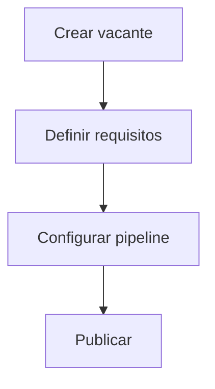
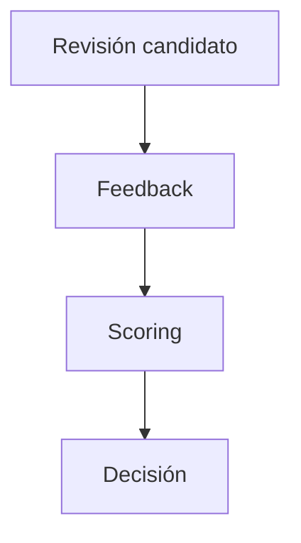
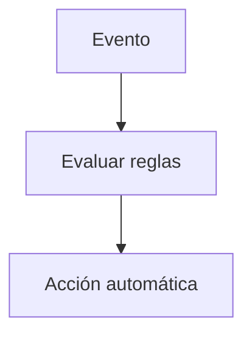
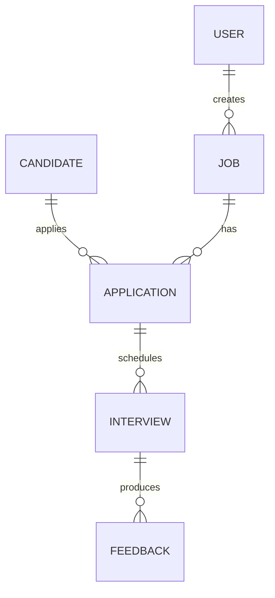
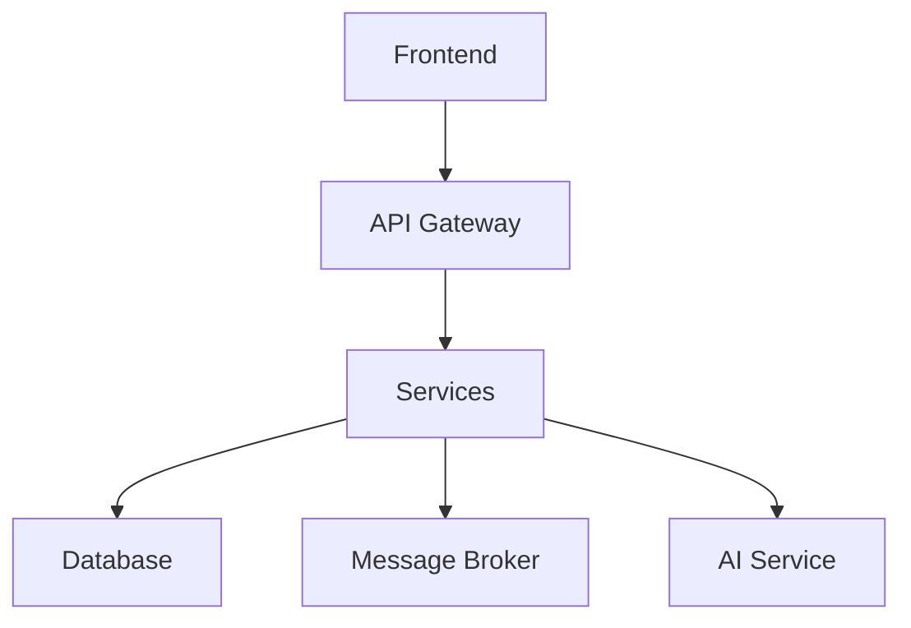
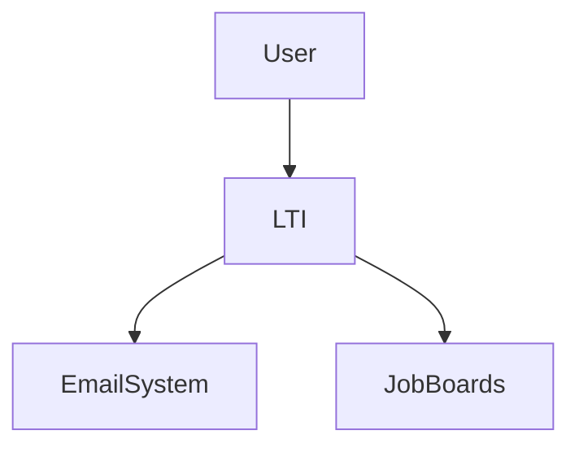
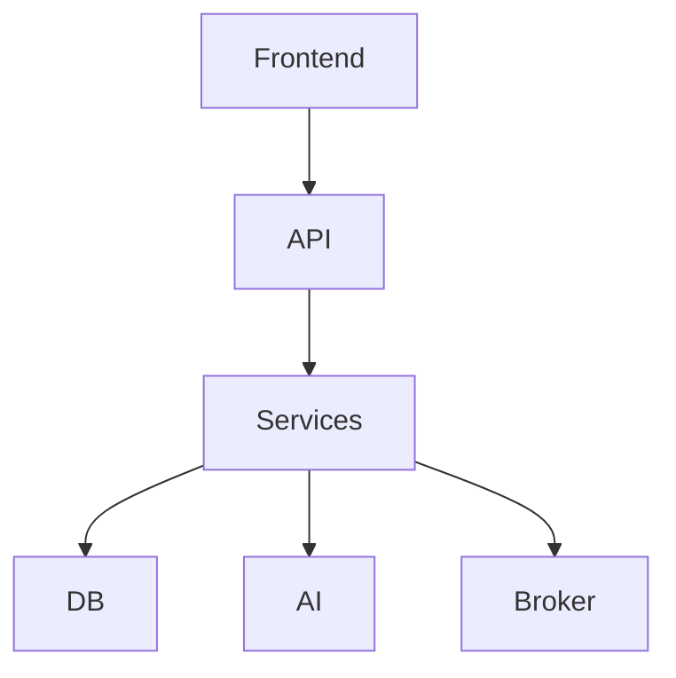
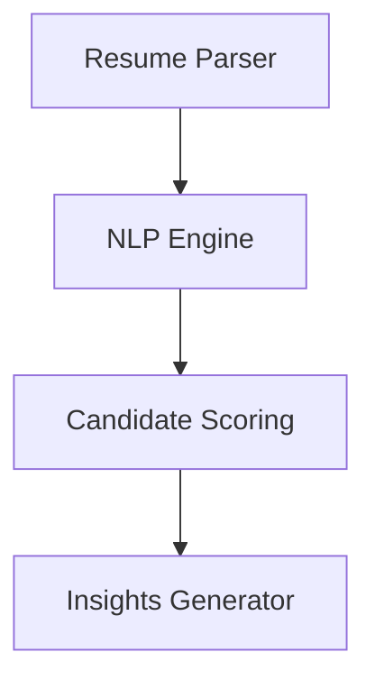

# LTI-JATM

## 1. Descripción del Producto

### Visión
LTI es un Applicant Tracking System (ATS) de nueva generación orientado a equipos de HR y organizaciones en crecimiento. Su objetivo es optimizar el ciclo completo de contratación mediante automatización inteligente, colaboración en tiempo real y capacidades avanzadas de IA, reduciendo el time-to-hire y mejorando la calidad de contratación.

### Propuesta de valor
- Reducir el time-to-hire en +40%
- Incrementar la calidad de contratación mediante scoring inteligente
- Alinear recruiters y hiring managers en tiempo real
- Automatizar tareas repetitivas y operativas

### Ventajas competitivas
- IA transversal (no como feature aislada)
- Sistema event-driven para automatización flexible
- Colaboración tipo Notion/Slack
- Arquitectura escalable desde MVP

### Funcionalidades principales (priorizadas)
1. Gestión de vacantes (Job Management)
2. Pipeline visual Kanban de candidatos
3. Evaluación colaborativa estructurada
4. Motor de automatización (workflows)
5. Motor de IA (screening, scoring, insights)

---

### Lean Canvas

| Bloque | Contenido |
|------|----------|
| Problema | Procesos manuales, baja visibilidad, decisiones subjetivas |
| Segmentos | Startups, scale-ups, empresas tech |
| Propuesta de valor | ATS inteligente, colaborativo y automatizado |
| Solución | Plataforma SaaS con IA + workflows |
| Canales | Ventas inbound/outbound, partnerships |
| Ingresos | SaaS por usuario + add-ons IA |
| Costes | Infraestructura cloud, desarrollo IA |
| Métricas | Time-to-hire, cost-per-hire, conversion rate |
| Ventaja competitiva | IA integrada + automatización + UX |

---

## 2. Casos de Uso

### Caso 1: Gestión de Vacantes

**Actores:** Recruiter

**Flujo principal:**
1. Crear vacante
2. Definir requisitos
3. Configurar pipeline
4. Publicar en múltiples canales

**Excepciones:**
- Validación fallida
- Falta de aprobación

---

### Caso 2: Evaluación Colaborativa

**Actores:** Recruiter, Hiring Manager

**Flujo principal:**
1. Revisar candidato
2. Añadir feedback estructurado
3. Calificar
4. Decidir avance

**Excepciones:**
- Feedback incompleto
- Conflicto de evaluación

---

### Caso 3: Automatización del Pipeline

**Actores:** Sistema

**Flujo principal:**
1. Detectar evento (ej: candidato aplicado)
2. Evaluar reglas
3. Ejecutar acción (email, mover etapa)

---

## 3. Modelo de Datos

### Entidades principales

**User**
- id: UUID
- name: string
- email: string
- role: enum

**Candidate**
- id: UUID
- name: string
- email: string
- resume_url: string

**Job**
- id: UUID
- title: string
- description: text
- status: enum

**Application**
- id: UUID
- candidate_id: UUID
- job_id: UUID
- stage: enum
- status: enum

**Interview**
- id: UUID
- application_id: UUID
- date: datetime

**Feedback**
- id: UUID
- interview_id: UUID
- score: int
- notes: text

### Relaciones
- User crea Job
- Candidate aplica a Job
- Application conecta Candidate y Job
- Interview pertenece a Application
- Feedback pertenece a Interview

---

## 4. Diseño de Alto Nivel

### Arquitectura propuesta
Arquitectura modular orientada a eventos (event-driven), con evolución a microservicios.

**Componentes:**
- Frontend (React + SPA)
- API Gateway
- Servicios:
  - Candidate Service
  - Job Service
  - Workflow Service
  - AI Service
- Message Broker (Kafka / RabbitMQ)
- Base de datos (PostgreSQL)

### Decisiones clave
- Event-driven → permite automatizaciones flexibles
- Separación de dominios → escalabilidad
- AI desacoplada → evolución independiente

---

## 5. C4 Model

### Nivel 1: Contexto

### Nivel 2: Contenedores

### Nivel 3: Componentes (AI Service)

---

## Bonus

### IA avanzada
- Parsing automático de CV
- Matching semántico job-candidate
- Scoring predictivo
- Generación automática de feedback

### Riesgos
- Sesgos en modelos de IA
- Complejidad operativa
- Dependencia de datos de calidad

### Mitigaciones
- Auditorías de modelos
- Human-in-the-loop
- Monitoreo continuo

### Roadmap

**MVP:**
- Gestión de vacantes
- Pipeline básico
- Evaluación

**Fase 2:**
- Automatización avanzada
- IA básica

**Fase 3:**
- IA predictiva
- Analytics avanzado

